# Éire Dubh

Éire Dubh (Black Ireland) is a website that looks at the dark pasts of obscure Irish emigrants, or with Irish heritage. Whereas other websites might deal with positive or famous examples, this site looks at the people who didn't make it to our history books or who aren't as well known due to the fact that their actions aren't looked upon positively here or abroad. It also briefly looks at the
history of Irish migration and the causes behind each wave to give the reader more background.

## User Experience (UX) - User Stories

### First-Time Visitor Goals
As a first-time visitor to this site...

I want to understand the purpose of the site and learn more about the the overall theme.

I want to be introduced to history that I have not learned of before.

I want my curiosity to be sparked about other stories.

I want to learn about the wider global history surrounding this site's theme.

I want to navigate throughout the site easily without any technical issue.

I want the content to be clear and well laid out.

I want a mix of media content.

I want to be directed to external sources.

I want an attractive aesthetic. 

 
### Returning/Frequent Visitor Goals

As a returning/frequent visitor...

I want to see updated content and new histories to learn.

I want to be able to contact the author with comments, stories or corrections.

I want to be reccommended external sources and media related to this site's theme.

## Responsive Mockup

# Features

### Navigation Bar

Featured on all four pages, the full responsive navigation bar includes links to the Home, People, Places and Contact pages. It is as fixed bar so the user does not need to scroll back to the top of the page to change pages. On hover the links' color transitions to orange, and active links are green.
On smaller devices, the page links are accessed via a full page drop-down menu which appears on clicking a burger menu icon.

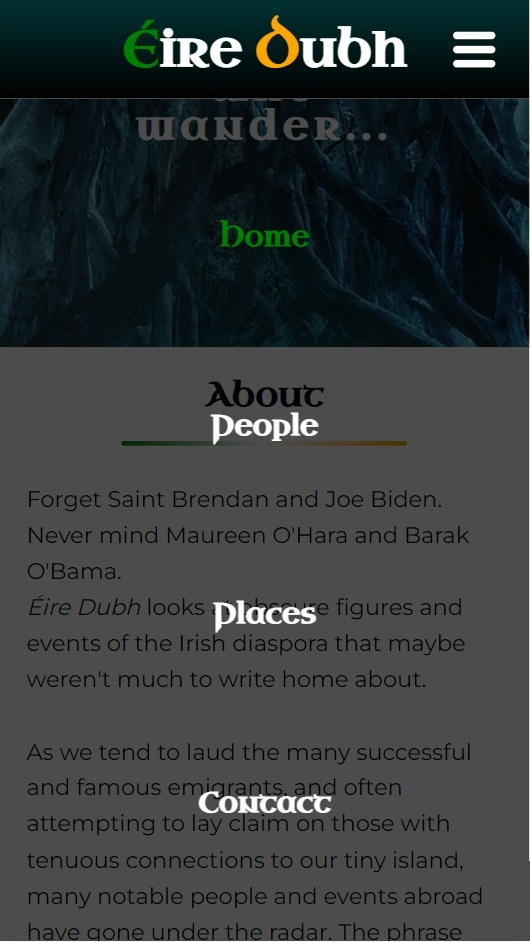

### Home page

The landing or home page includes a banner section of a phot with text overlay. This introduces the viewer to the page's dark theme. This banner section is used on all pages except the Contact page.

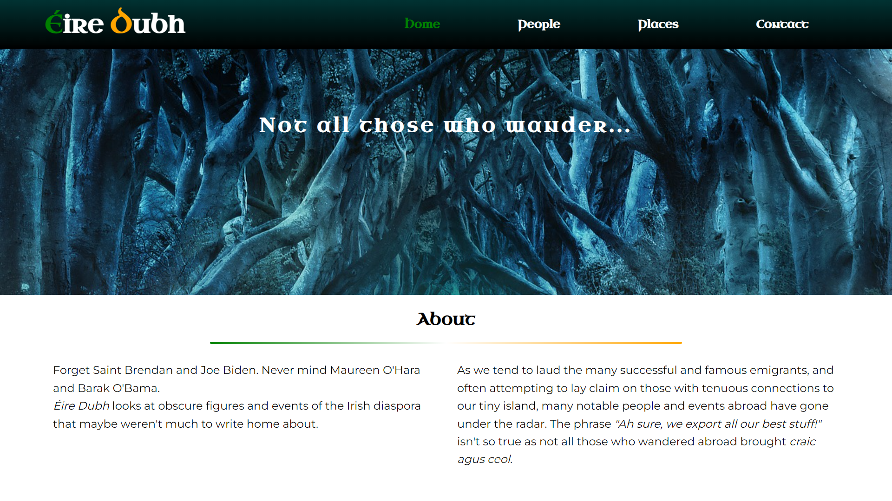

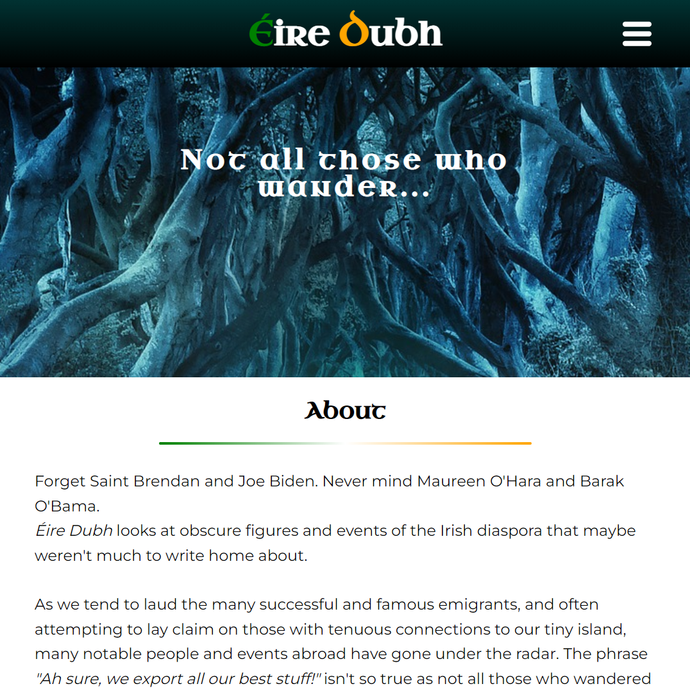
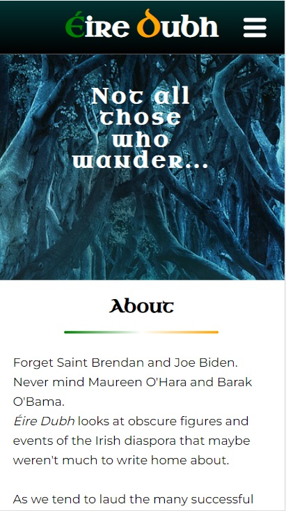

### 'About' section

The About section gives the visitor more details on the purpose of the website and directs attention to the 'People' page, which is the focus of the website.

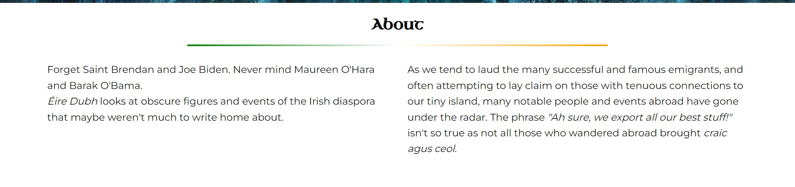

### 'Nature or Nurture?' section

This section's content directs the visitor to the 'Places' page to understand the circumstances and background behind the articles. A link at the end of the content brings the user directly to the page.

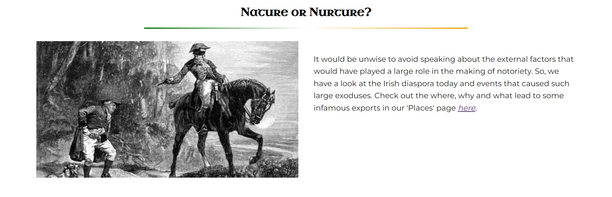

### Cards section

The cards section consist of links to the articles in the 'People' page with supporting taglines and images of each figure. This allows the user to go directly to the article without having to scroll back up to the top of the page. It has an animated transition on hover.
This cards section is also found on the 'Places' page.

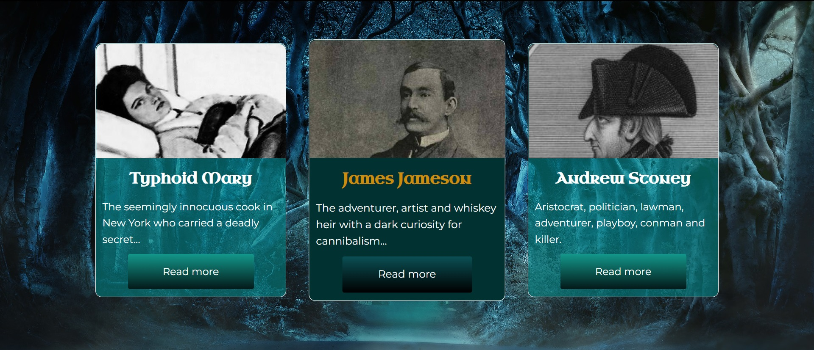

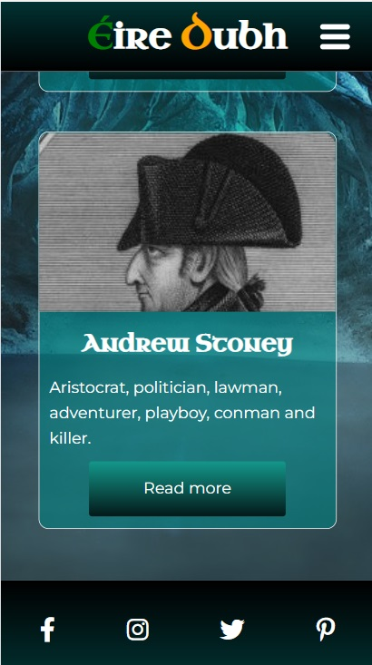

### Footer

The footer section includes links to social media sites Facebook, Instagram, Twitter and Pinterest for Éire Dubh. The links will open to a new tab to allow easy navigation for the user and to keep the user on the Éire Dubh website too. On hover the icons' color transitions.

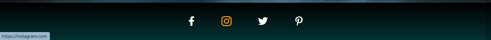

### People page

The People page follows the same layout of the 'Home' page without the cards section. Its content consists of three brief stories, each following the same layout of alternating image and text, and is divided by styled horizontal rules and headers. Each story also links to Wikipedia's longer more detailed articles about the figures.

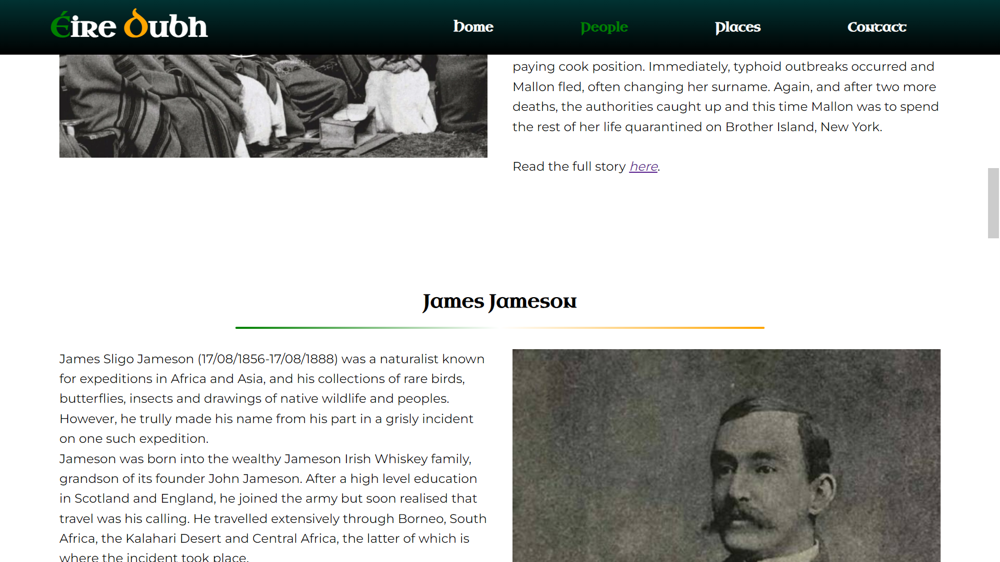

### Places Page

The 'Places' page follows the same layout as above, with a cards section linking to the 'People' articles. This page functions as a supporting page to give the visitor more background information about Irish emigration and the circumstances surrounding the figures. It includes a styled table giving a timeline of events in support of the above content.
It also briefly comments on Irish emigration today.

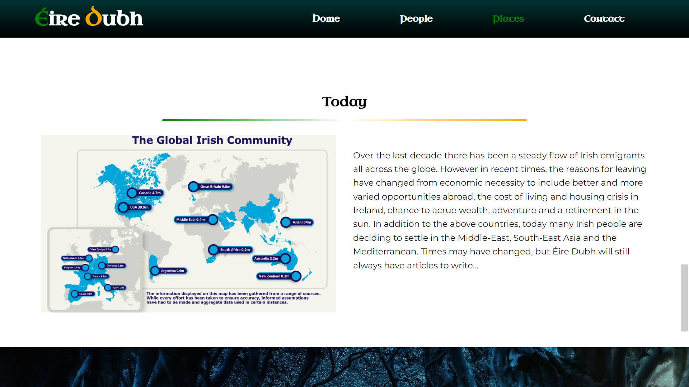

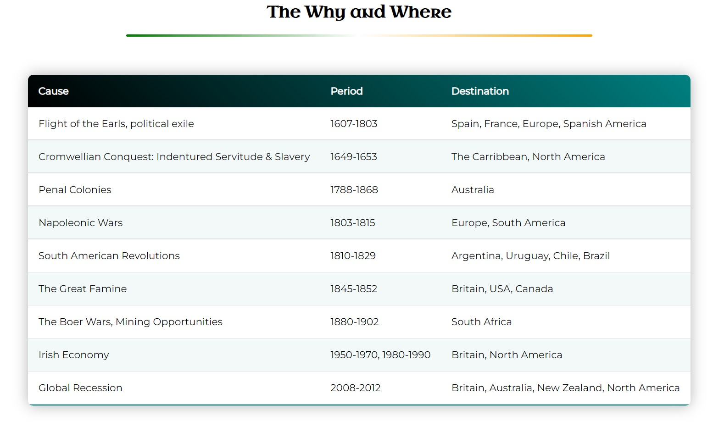
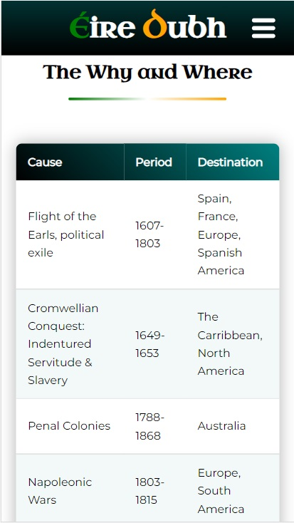

### Contact Page

The 'Contact' page breaks from the general styling of the rest of the site in that it uses the header image as a full-page background. Contacts for the page author and a form element are overlayed on top allowing the user to submit messages, comments, stories or corrections to the host.
This page presented a styling bug where white space appeared both above and below the main section, the status/fixing of which is detailed below under "Bugs".

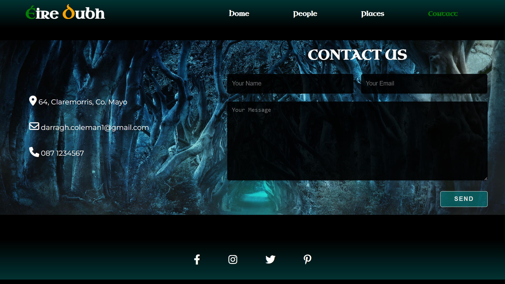
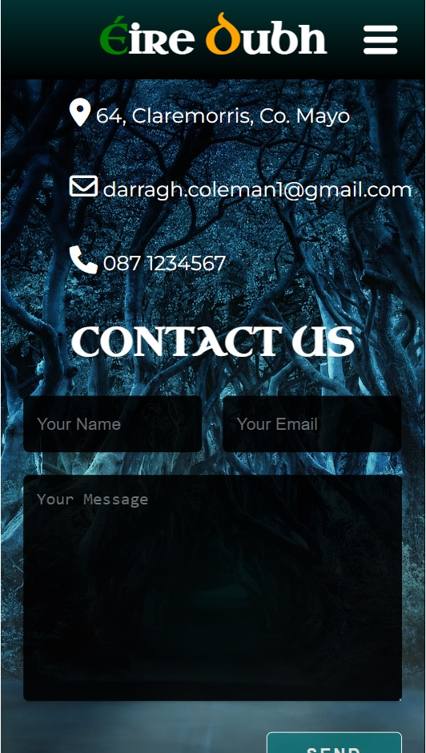

## Features Left to Implement

Other future features would be to include a 'Reccommended' page which would promote authors, media, other websites or related content, and direct the user to them via links.
Javascript would also aid in functionality of the site such as drop-down menus and zoom images.

## Testing

Testing was taken across various browsers and screen sizes. I tested the site on Google Chrome, Mozilla Firefox, Microsoft Edge and Opera. Across all browsers the site responded and appeared identical from small screen devices up to large screens. However, through this testing I discovered a bug when opened with Firefox.
The bug, in the footer section, consisted of misaligned bordered circles surrounding the social media icons. It only occurred when using Firefox inspect console with small devices lower than 440px. This seemed unusual as no properties or media queries were set as such. I attempted to rectify the problem through re-styling the circles but was unsuccessful. Some online research showed that other users found similar bugs with the Firefox inspect console, but rather than fully trusting in this and allowing the issue to remain,  as a small non-essential feature I decided to comment out the circles in the stylesheet.
All internal and external links working correctly across all browsers.

## Validator Testing

### HTML:
One error throughout all pages appears on the validator. I fixed the error according to the validator service, however, I undid the removal as the error is essential to the function of the burger menu and drop-down list. From validator.w3.org:

Error: Element div not allowed as child of element label in this context. (Suppressing further errors from this subtree.)

From line 33, column 17; to line 33, column 34

          

### CSS:
No errors were found when passing through the official (Jigsaw) validator.

## Bugs

Having used utility style classes as much as possible, the aforemention bug on the 'Contact' page was not able to be completely fixed without causing other major styling errors across all other pages. However, the bug has been somewhat fixed by hiding its visibility through styling the body in black, which subtlely causes the navbar and footer to appear higher than other pages. The color scheme allows for this to not have any aesthetic issues.

During the project quite a lot of bugs in styling occurred. Principally in the fixed navbar, footer, header, contact page and overall styling. The main root of the issues was styling individual elements for screen responsiveness.
Initially begun for desktop view, media queries were added from there. This worked up to a point until major errors were occurring in overwriting and overriding style rules.
In the end, what content and code that could be reused was saved and the project essentially restarted from scratch, this time taking a simplified and mobile-first approach using utility classes. This made the rest of the project a more seemless process and easier to make minor adjustments.

## Deployment

This section should describe the process you went through to deploy the project to a hosting platform (e.g. GitHub)

The site was deployed to GitHub pages. The steps to deploy are as follows:
In the GitHub repository, navigate to the Settings tab
From the source section drop-down menu, select the Master Branch
Once the master branch has been selected, the page will be automatically refreshed with a detailed ribbon display to indicate the successful deployment.
The live link can be found here - https://code-institute-org.github.io/love-running-2.0/index.html

## Credits:

### Content

The text for the 'Home', 'Places' and 'Contact' pages is original content.
The text for the 'People' pages was taken from various sources. The histories were condensed, restructured and non-essential information ommitted in order to fit with site's layout. These sources included:

#### Mary Mallon article:

https://en.wikipedia.org/wiki/Mary_Mallon

https://www.ncbi.nlm.nih.gov/pmc/articles/PMC3959940/

https://www.britannica.com/biography/Typhoid-Mary

#### James Jameson article:

https://en.wikisource.org/wiki/Dictionary_of_National_Biography,_1885-1900/Jameson,_James_Sligo

https://allthatsinteresting.com/james-jameson-cannibal

https://www.irishtimes.com/life-and-style/travel/a-grisly-drop-of-history-1.755086

#### Andrew Robinson Stoney article:

https://en.wikipedia.org/wiki/Andrew_Robinson_Stoney

https://en.wikipedia.org/wiki/Mary_Bowes,_Countess_of_Strathmore_and_Kinghorne

https://en-academic.com/dic.nsf/enwiki/4268914

https://allthatsinteresting.com/andrew-robinson-stoney

Instructions on how to implement the general site elements were taken from CodeInstitute's tutorials.

Instructions on how to implement the media queries, color gradients, transitions and other methods were taken from W3schools.org. 

Instructions on how to implement the navbar was taken from https://www.youtube.com/watch?v=S-JyJCVx_4Y&ab_channel=MinzCode

Instructions on how to implement the responsive layout and utility classes was taken from https://www.youtube.com/watch?v=bn-DQCifeQQ&ab_channel=KevinPowell
and
https://www.youtube.com/watch?v=FpuJiNyDsC8&ab_channel=CodingMarket

Instructions on how to implement the animated cards section was taken from https://www.youtube.com/watch?v=qXRYMdvq_Dc&ab_channel=CemEygiMedia

Instructions on how to implement the table style was taken from https://www.youtube.com/watch?v=biI9OFH6Nmg&ab_channel=dcode

Instructions on how to implement the 'Contact' page layout and form was taken from https://www.youtube.com/watch?v=8kTPtrz7PiU&ab_channel=CodingSnow

The icons in the footer were taken from Font Awesome

### Media

The photos used as the banner image was taken from the Pexels.com open source site.
The images used for the Home, People and Places pages were taken from https://www.wikipedia.org and https://commons.wikimedia.org.

The maps used for the 'Places' page were taken from https://blogsarchive.sites.haverford.edu/celticfringe/2014/03/04/the-irish-diaspora-what-does-it-mean-to-be-irish/
